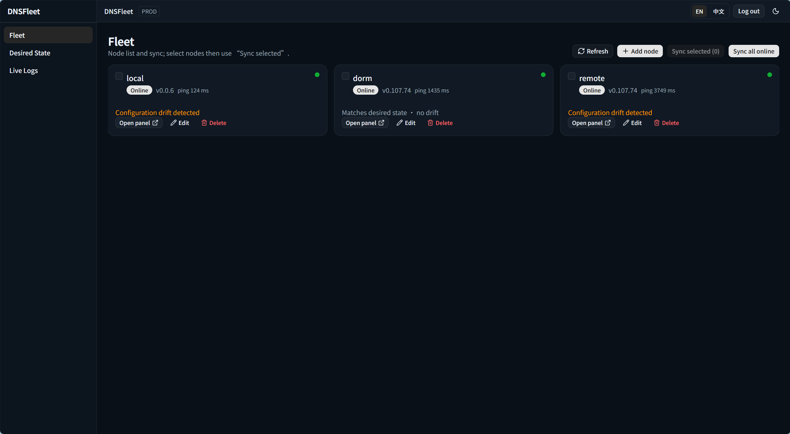
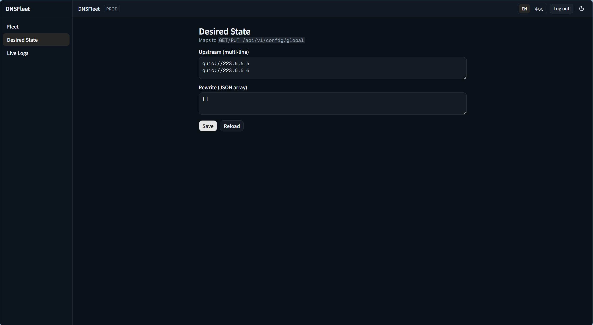
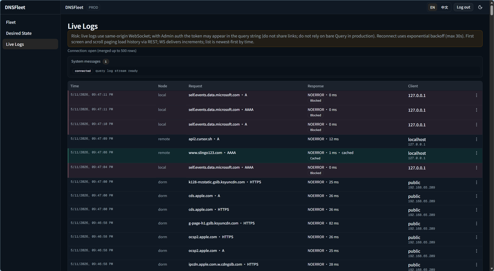

# DNSFleet

[](https://codecov.io/github/lensdns/dnsfleet?branch=master)
[](https://goreportcard.com/report/lensdns/dnsfleet)
[](https://godoc.org/github.com/lensdns/dnsfleet)

**Chinese version:** [README_zh.md](README_zh.md)

<p align="center"></p>

A **self-hosted control plane** for operating a **fleet of AdGuard Home** nodes from one place: register nodes, push desired configuration, run sync and drift checks, and watch **Live Logs** (WebSocket tail plus REST-backed history). The data plane stays on **AdGuard Home** at the edge; DNSFleet holds control-plane state in **SQLite** and talks to each node over HTTP.

**Scope (v0.1.x):** single shared **Admin** credential, **no durable storage of query logs** (real-time observation only), no multi-tenant RBAC. Intended for **homelab** and **small edge fleets** where one operator controls a bounded set of nodes.

The embedded web console supports **English and Chinese** UI copy; **English is the default**, and you can switch language from the dashboard header (persisted in the browser). REST/WebSocket API messages stay as returned by the server.

## Demo

### Fleet



### Desired State



### Live Logs



## Who it is for

- Operators who already run **AdGuard Home** on several hosts and want a **single UI and API** for inventory, sync, and live query visibility.
- Teams comfortable with **self-hosted** services, **Bearer-style admin auth**, and **TLS termination** in front of the process (reverse proxy).

**Not a fit (today):** centralized long-term DNS analytics / SIEM, non–AdGuard Home resolvers as first-class data plane, or hosted multi-tenant SaaS.

## Capabilities

- **Nodes:** CRUD, credentials (`basic` / `bearer`), online/offline signal, sync to AdGuard Home.
- **Desired state:** global upstream / rewrite expectations (see API and UI).
- **Sync & drift:** pull and compare remote config on a schedule; bounded concurrency to each node.
- **Live Logs:** control plane **Hub** polls `GET /control/querylog` per online node; browsers receive tail traffic on **`GET /api/v1/ws/logs`** and page older rows via **`GET /api/v1/nodes/:id/querylog`** (see [`api/DNSFLEET_HTTP_API.md`](api/DNSFLEET_HTTP_API.md) — WebSocket `log` / optional **`fingerprint`** vs REST-derived dedupe is spelled out there).
- **Distribution:** production build embeds the **Next.js static export** into the Go binary (`go:embed`); one listening port for UI + API. **Docker** image and **Compose** files under [`deploy/`](deploy/).

**Released builds:** see **GitHub Releases** for versioned **static binaries** (Linux, Windows, macOS; amd64/arm64 where applicable), **checksums**, and **container images** on **GHCR** (tag `v*` workflow).

## Run a release binary or container (no Go / Node)

You do **not** need a compiler on the machine where the control plane runs.

### Asset names on GitHub Releases

Each archive or standalone file follows:

`dnsfleet-<tag>-<os>-<arch>[.exe]`

- **`<tag>`** is the Git tag for that release (see the release page on GitHub).
- **`<os>`** is `linux`, `windows`, or `darwin`.
- **`<arch>`** is `amd64` or `arm64`.
- **`.exe`** is only on Windows.

**Version placeholder:** In the table and shell examples below, **`vX.Y.Z` is a placeholder** — replace it with the **actual Git tag** from the release you downloaded (for example **`v0.2.0`**).

| OS / arch | Example filename |
|-----------|------------------|
| Windows amd64 | `dnsfleet-vX.Y.Z-windows-amd64.exe` |
| Linux amd64 | `dnsfleet-vX.Y.Z-linux-amd64` |
| Linux arm64 | `dnsfleet-vX.Y.Z-linux-arm64` |
| macOS amd64 (Intel) | `dnsfleet-vX.Y.Z-darwin-amd64` |
| macOS arm64 (Apple Silicon) | `dnsfleet-vX.Y.Z-darwin-arm64` |

Verify downloads with **`SHA256SUMS`** from the same release.

### Minimal CLI: native binary

The process reads **environment variables** first (see [Configuration](#configuration)); it does **not** read a `.env` file by itself.

**Optional flags** **`-admin-token`** and **`-listen`**, when non-empty, **override the corresponding configuration fields** after values are read from the environment (**`DNSFLEET_ADMIN_TOKEN`** and **`DNSFLEET_HTTP_ADDR`**, respectively; same sequence as **`dnsfleet -h`**). Go uses a **single** leading `-`; run **`dnsfleet -h`** for built-in help.

**Linux / macOS** (from the directory containing the binary):

```bash
chmod +x dnsfleet-vX.Y.Z-linux-amd64   # Linux example; skip on macOS if already executable
export DNSFLEET_ADMIN_TOKEN='your-long-random-secret'
./dnsfleet-vX.Y.Z-linux-amd64
```

**Windows (PowerShell)**:

```powershell
cd ~\Downloads   # or wherever you saved the file
$env:DNSFLEET_ADMIN_TOKEN='your-long-random-secret'
.\dnsfleet-vX.Y.Z-windows-amd64.exe
```

**Same examples with a flag instead of `export` / `$env:`** (handy for a first run; see security note below):

```bash
./dnsfleet-vX.Y.Z-linux-amd64 -admin-token 'your-long-random-secret'
```

```powershell
.\dnsfleet-vX.Y.Z-windows-amd64.exe -admin-token 'your-long-random-secret'
```

Optional listen override: **`-listen :8081`** (overrides **`DNSFLEET_HTTP_ADDR`**; when the env var is unset, the default remains **`:8080`**).

**Security:** On Unix-like systems, other users may see process **arguments** in **`ps(1)`**; on **shared hosts** prefer **`DNSFLEET_ADMIN_TOKEN`** via the environment (systemd, Docker, Compose) or a secret manager instead of putting secrets on the command line.

Then open **`http://127.0.0.1:8080`** (unless you passed **`-listen`**). Smoke test: **`GET /healthz`** returns **`ok`**.

If the window closes immediately when double-clicking the `.exe`, run it from PowerShell or CMD so you can see the error (usually a missing admin token—set **`DNSFLEET_ADMIN_TOKEN`**, pass **`-admin-token`**, or use **`DNSFLEET_ADMIN_INSECURE_DISABLE=1`** for local-only). **`dnsfleet -h`** prints usage without starting the server or creating the SQLite data directory.

### Lower-friction ways to supply the Admin token

Typing `export` / `$env:...` each time is normal for servers but annoying on a laptop. Practical options:

1. **Docker Compose** — clone or copy [`deploy/docker-compose.yml`](deploy/docker-compose.yml), replace **`DNSFLEET_ADMIN_TOKEN: "change-me-in-production"`** with your secret, then from the repo root:  
   `docker compose -f deploy/docker-compose.yml up --build`  
   (No shell `export` needed; see [`deploy/README.md`](deploy/README.md) for volumes and permissions.)

2. **Small wrapper next to the binary** — e.g. on Windows, `run-dnsfleet.ps1` containing only setting `$env:DNSFLEET_ADMIN_TOKEN` and `Start-Process` / `& .\dnsfleet-....exe`.

3. **`.env` + shell** — copy [`.env.example`](.env.example) to **`.env`**, edit **`DNSFLEET_ADMIN_TOKEN`**, then in **bash**:

   ```bash
   set -a && source .env && set +a && ./dnsfleet-vX.Y.Z-linux-amd64
   ```

   (Still environment variables under the hood; the file is just easier to edit than a long one-liner.)

Optional **auto-load of `.env` inside the Go binary** would add behavior and edge cases (Windows paths, quoting, secrets on disk); v0.1.x keeps **explicit env only**. If you want file-based config without a shell, Compose or a one-line wrapper is the usual approach.

### Docker image from GHCR (no local build)

Use the image tag published with the release (example org/repo; confirm on the release page if yours differs):

```bash
docker run --rm \
  -e DNSFLEET_ADMIN_TOKEN=your-long-random-secret \
  -p 8080:8080 \
  ghcr.io/lensdns/dnsfleet:vX.Y.Z
```

Persist SQLite in a volume (path inside the container must be writable; see [`deploy/README.md`](deploy/README.md)):

```bash
docker run --rm \
  -e DNSFLEET_ADMIN_TOKEN=your-long-random-secret \
  -e DNSFLEET_DB_PATH=/data/dnsfleet.db \
  -p 8080:8080 \
  -v dnsfleet-data:/data \
  ghcr.io/lensdns/dnsfleet:vX.Y.Z
```

## Quick start (build from source)

**Requirements:** Go **1.26+** (see `go.mod`), **Node 22+** only if you rebuild the web UI from [`web/`](web/).

If you only need a prebuilt binary or container, use [Run a release binary or container](#run-a-release-binary-or-container-no-go--node) above.

1. Copy [`.env.example`](.env.example) to `.env` (or export the same variables). The process reads **`os.Getenv`** only; it does **not** auto-load `.env`.
2. Set **`DNSFLEET_ADMIN_TOKEN`** to a strong secret (unless you deliberately use the insecure dev switch documented below).
3. Build the UI and embed it, then run:

```bash
cd web && npm ci && npm run build && cd ..
make ensure-webui-dist   # Unix / Git Bash; or: powershell -File scripts/ensure-webui-dist.ps1
go run ./cmd/dnsfleet    # optional: -admin-token … / -listen … / -h
```

**Docker (recommended for trials):** from the repository root (build context is the repo root):

```bash
docker compose -f deploy/docker-compose.yml up --build
```

Details: [`deploy/README.md`](deploy/README.md) (volumes, non-root UID, image build args). Local **Next dev** with API rewrites: [`web/README.md`](web/README.md).

## Repository layout

| Path | Purpose |
|------|---------|
| `cmd/dnsfleet/` | Process entrypoint |
| `internal/` | Application code (HTTP, DB, AdGuard Home client, querylog hub, embedded UI) |
| `api/` | Public HTTP contract notes ([`DNSFLEET_HTTP_API.md`](api/DNSFLEET_HTTP_API.md)) |
| `web/` | Next.js UI (static export for embed) |
| `deploy/` | Dockerfile and Compose |
| `scripts/` | Helper scripts (e.g. sync `web/out` into `internal/webui/dist`) |

## Configuration

All variables are read at startup from the environment (see [`internal/config/config.go`](internal/config/config.go)). **Optional flags** **`-admin-token`** and **`-listen`**, when non-empty, override **`DNSFLEET_ADMIN_TOKEN`** and **`DNSFLEET_HTTP_ADDR`** after values are read from the environment (same sequence as **`dnsfleet -h`**). Run **`dnsfleet -h`** for a short summary.

| Variable | Default | Description |
|----------|---------|-------------|
| `DNSFLEET_DB_PATH` | `./data/dnsfleet.db` | SQLite **file** path (resolved to an absolute path on load). Not `:memory:`. Parent directory is created if missing. |
| `DNSFLEET_HTTP_ADDR` | `:8080` | Listen address (Echo). |
| `DNSFLEET_ADMIN_TOKEN` | (required) | Shared secret for **`/api/v1`** (`Authorization: Bearer` or `X-Admin-Token`). Empty token fails startup **unless** insecure mode is enabled. |
| `DNSFLEET_ADMIN_INSECURE_DISABLE` | unset | If **exactly** `1`, skips Admin checks and allows an empty token. **Do not use in production** or on an exposed network. |
| `DNSFLEET_SYNC_MAX_CONCURRENT` | `8` | Cap concurrent AdGuard Home HTTP calls for **drift**, **`POST /api/v1/sync`**, **`GET /api/v1/nodes/:id/querylog`**, and **`POST /api/v1/nodes/:id/probe`**. Probes run while **creating or editing** a node **do not** use this semaphore (see [`api/DNSFLEET_HTTP_API.md`](api/DNSFLEET_HTTP_API.md)). |
| `DNSFLEET_SYNC_TOTAL_TIMEOUT` | `5m` | Total timeout for **`POST /api/v1/sync`** (`time.ParseDuration`). |
| `DNSFLEET_DRIFT_INTERVAL` | `5m` | Drift ticker interval; one drift run happens immediately on startup. |
| `DNSFLEET_QUERYLOG_MAX_CONCURRENT` | `8` | Cap concurrent **`GET /control/querylog`** calls from the querylog Hub (independent of sync cap). |
| `DNSFLEET_QUERYLOG_POLL_INTERVAL` | `2s` | Hub polling interval per online node. |
| `DNSFLEET_QUERYLOG_PAGE_LIMIT` | `100` | Hub **single-page** `limit` for `GET /control/querylog`. REST history uses its own default (`20`, max `100`); the two need not match. |
| `DNSFLEET_WS_MAX_FRAME_BYTES` | `65536` | Max outbound WebSocket **text** frame size toward browsers. |

**HTTP:** **`GET /healthz`** (no Admin). **`/api/v1`** REST and **`/api/v1/ws/logs`** WebSocket require Admin (see [`api/DNSFLEET_HTTP_API.md`](api/DNSFLEET_HTTP_API.md)).

## Security and limits

- **Single operator model:** one Admin secret for the control plane API and WebSocket upgrade path used by the UI.
- **Query logs are not a database product:** tail and REST pages are **ephemeral** from the operator’s perspective; do not rely on DNSFleet as long-term audit storage.
- **Reverse proxies:** terminate TLS and forward **WebSocket** headers (`Upgrade`, `Connection`) or Live Logs will fail through the proxy.
- **Client bundle:** any **`NEXT_PUBLIC_*`** value is fixed at **web build time**; do not bake insecure skips into production images (see [`deploy/docker-compose.yml`](deploy/docker-compose.yml) comments).

## Development and CI

From the repository root:

```bash
go fmt ./...
go vet ./cmd/... ./internal/...
go test ./cmd/... ./internal/...
```

`go test` requires a non-empty **`internal/webui/dist`** (run `make ensure-webui-dist` after `web` production build, or `make test` which prepares it). Avoid **`go test ./...`** from the repo root if **`web/node_modules`** exists, to prevent the Go tool from picking up unrelated packages.

**Web checks** ([`web/README.md`](web/README.md)):

```bash
cd web && npm ci && npm run lint && npm run test && npm run build
```

**GitHub Actions:** [`.github/workflows/ci.yml`](.github/workflows/ci.yml) runs the **Go + web** matrix on **Ubuntu, Windows, and macOS**, uploads **Go coverage** from the Ubuntu job to [**Codecov**](https://codecov.io) (optional repo secret **`CODECOV_TOKEN`**, or enable Codecov’s GitHub app / OIDC on your account), then builds the **same Docker image as release** with **no registry push**. Pushing a tag matching **`v*`** runs [`.github/workflows/release.yml`](.github/workflows/release.yml): same tests, **multi-platform static binaries** and **SHA256SUMS** attached to the GitHub Release, and the image pushed to **GHCR**.

Design documents and maintainer-only notes are **not shipped** with this repository; behavior is defined by **code** and the **public** files linked above.

## Contributing

See **[CONTRIBUTING.md](CONTRIBUTING.md)** for how we scope features (unified operational surface, Tier A/B/C, anti-goals) and what to run before opening a PR.

## License

[MIT](LICENSE)
