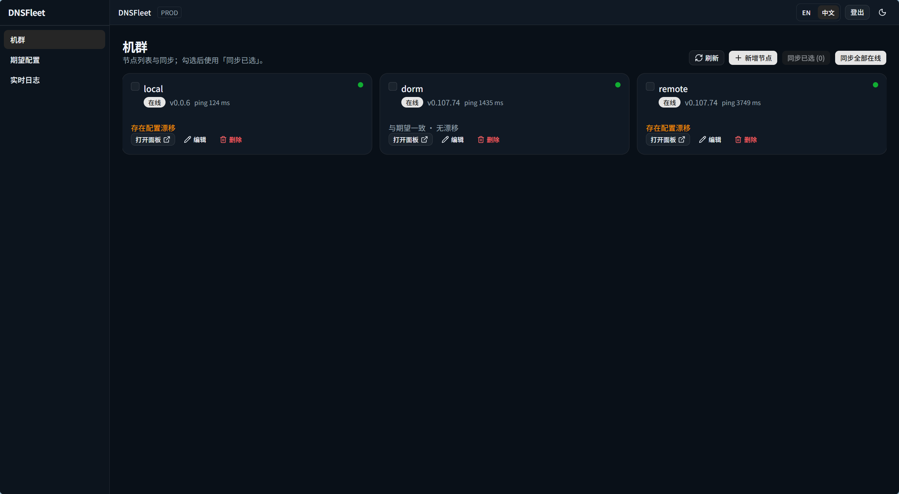
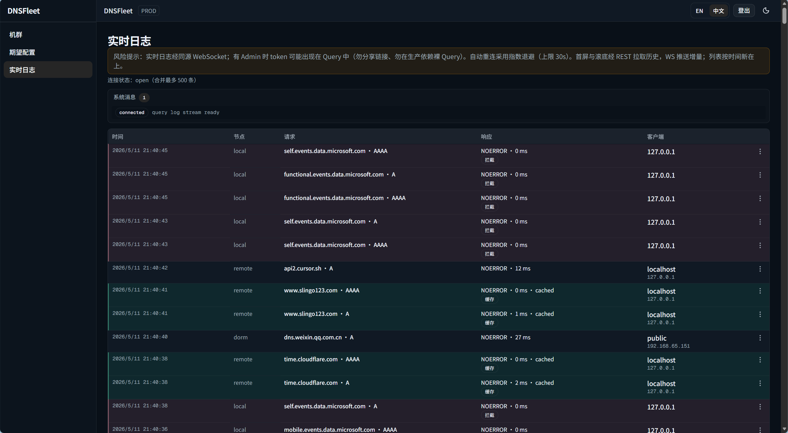

# DNSFleet

[](https://codecov.io/github/lensdns/dnsfleet?branch=master)
[](https://goreportcard.com/report/lensdns/dnsfleet)
[](https://godoc.org/github.com/lensdns/dnsfleet)

**English:** [README.md](README.md)

<p align="center"></p>

**自托管控制面**，用于从一处管理 **多台 AdGuard Home**：登记节点与凭据、下发期望配置、执行同步与漂移检查，并通过 **Live Logs**（WebSocket 尾包 + REST 历史分页）观测查询日志。解析仍在边缘的 **AdGuard Home**；DNSFleet 在控制面用 **SQLite** 保存状态，经 HTTP 与各节点通信。

**能力边界（v0.1.x）：** 单一共享 **Admin** 凭据；**查询日志不落库**（仅实时观测）；无多租户复杂 RBAC。适用于 **Homelab** 与 **小规模边缘机群** 等单运维、节点规模可控的场景。

## Demo

### Fleet



### Desired State


### Live Logs



## 适用对象

- 已在多台机器运行 **AdGuard Home**，希望用 **统一 Web 与 REST API** 管理清单、同步与实时查询视图。
- 接受 **自建**、**Bearer 类 Admin 鉴权**，并在进程前用 **反向代理做 TLS 终结** 的运维方式。

**当前不适合：** 将本产品当作中心化长期 DNS 分析 / SIEM；将非 AdGuard Home 解析器作为一等数据面；或托管多租户 SaaS。

## 核心能力

- **节点：** 增删改查、凭据（`basic` / `bearer`）、在线状态、向 AdGuard Home 同步。
- **期望状态：** 全局 upstream / rewrite 等（以 API 与界面为准）。
- **同步与漂移：** 按周期拉取并比对远端配置；对单节点并发有上限。
- **Live Logs：** 控制面 **Hub** 对在线节点轮询 **`GET /control/querylog`**；浏览器经 **`GET /api/v1/ws/logs`** 收尾包，经 **`GET /api/v1/nodes/:id/querylog`** 翻更旧页（契约见 [`api/DNSFLEET_HTTP_API.md`](api/DNSFLEET_HTTP_API.md)）。
- **交付形态：** 生产构建将 **Next.js 静态导出** 嵌入 Go 二进制（`go:embed`），**同一端口** 提供 UI 与 API；**Docker** 与 **Compose** 见 [`deploy/`](deploy/)。

**发行物：** 见 **GitHub Releases** 的版本化 **静态二进制**（Linux / Windows / macOS；含 amd64/arm64 等组合）、**校验和**，以及推送到 **GHCR** 的容器镜像（推送 **`v*`** 标签触发工作流）。

## 直接运行发行版（无需本机 Go / Node）

运行控制面的机器上**不必**安装编译器。

### GitHub Releases 上的文件名

一般为：

`dnsfleet-<标签>-<系统>-<架构>[.exe]`

- **`<标签>`**：该次 Release 在 GitHub 上对应的 Git 标签。
- **`<系统>`**：`linux`、`windows`、`darwin`。
- **`<架构>`**：`amd64` 或 `arm64`。
- **`.exe`**：仅 Windows。

**版本占位符：** 下表与下文 shell 示例中的 **`vX.Y.Z` 仅为占位符**，请替换为你所下载 Release 的 **真实 Git 标签**（例如 **`v0.2.0`**）。

| 系统 / 架构 | 示例文件名 |
|-------------|------------|
| Windows amd64 | `dnsfleet-vX.Y.Z-windows-amd64.exe` |
| Linux amd64 | `dnsfleet-vX.Y.Z-linux-amd64` |
| Linux arm64 | `dnsfleet-vX.Y.Z-linux-arm64` |
| macOS amd64（Intel） | `dnsfleet-vX.Y.Z-darwin-amd64` |
| macOS arm64（Apple Silicon） | `dnsfleet-vX.Y.Z-darwin-arm64` |

请用同一次 Release 里的 **`SHA256SUMS`** 校验下载文件。

### 最小命令行：原生二进制

进程**首先**从**环境变量**载入配置（见下文 [配置](#配置)），**不会**自动读取项目根下的 `.env` 文件。**环境变量读入后**，可选用 **`-admin-token`**、**`-listen`**：仅在**非空**时分别覆盖 **`DNSFLEET_ADMIN_TOKEN`**、**`DNSFLEET_HTTP_ADDR`**（顺序与 **`dnsfleet -h`** 一致）。Go 惯例为**单横线** `-`；运行 **`dnsfleet -h`** 查看内置说明。

**Linux / macOS**（在二进制所在目录）：

```bash
chmod +x dnsfleet-vX.Y.Z-linux-amd64   # 以 Linux 为例；macOS 若已可执行可省略
export DNSFLEET_ADMIN_TOKEN='你的长随机密钥'
./dnsfleet-vX.Y.Z-linux-amd64
```

**Windows（PowerShell）**：

```powershell
cd ~\Downloads   # 或你保存 exe 的目录
$env:DNSFLEET_ADMIN_TOKEN='你的长随机密钥'
.\dnsfleet-vX.Y.Z-windows-amd64.exe
```

**不想先设环境变量时，可用 flag 首次启动**（见下安全提示）：

```bash
./dnsfleet-vX.Y.Z-linux-amd64 -admin-token '你的长随机密钥'
```

```powershell
.\dnsfleet-vX.Y.Z-windows-amd64.exe -admin-token '你的长随机密钥'
```

监听地址可选 **`-listen :8081`**（覆盖 **`DNSFLEET_HTTP_ADDR`**；若环境变量未设置，默认仍为 **`:8080`**）。

**安全：** 在类 Unix 系统上，其他用户可能通过 **`ps(1)`** 看到**进程参数**；在**共享主机**上更推荐通过环境（systemd、Docker、Compose）或密钥系统注入 **`DNSFLEET_ADMIN_TOKEN`**，避免在命令行上暴露密钥。

浏览器打开 **`http://127.0.0.1:8080`**（若使用了 **`-listen`** 则改为对应端口）。烟测：**`GET /healthz`** 应返回 **`ok`**。

若在资源管理器里**双击** `.exe` 窗口一闪而过，请在 PowerShell / CMD 里运行以便看到报错（常见为未提供 Admin token：设置 **`DNSFLEET_ADMIN_TOKEN`**、传入 **`-admin-token`**，或本地开发用 **`DNSFLEET_ADMIN_INSECURE_DISABLE=1`**）。**`dnsfleet -h`** 仅打印用法，**不会**启动服务或创建数据目录。

### 不想每次敲 `export` / `$env:` 时怎么办

环境变量是服务端常见约定，但日常笔记本上反复输入确实麻烦，可以这样选：

1. **Docker Compose** — 克隆或复制 [`deploy/docker-compose.yml`](deploy/docker-compose.yml)，把其中的 **`DNSFLEET_ADMIN_TOKEN: "change-me-in-production"`** 改成你的密钥，在仓库根执行：  
   `docker compose -f deploy/docker-compose.yml up --build`  
   不必在 shell 里 `export`；卷与权限见 [`deploy/README.md`](deploy/README.md)。

2. **在 exe 旁放一个小脚本** — 例如 Windows 下 `run-dnsfleet.ps1` 里两行：设置 `$env:DNSFLEET_ADMIN_TOKEN` 再调用 `.\dnsfleet-….exe`。

3. **`.env` + shell** — 复制 [`.env.example`](.env.example) 为 **`.env`**，编辑 **`DNSFLEET_ADMIN_TOKEN`**，在 **bash** 中：

   ```bash
   set -a && source .env && set +a && ./dnsfleet-vX.Y.Z-linux-amd64
   ```

   （本质仍是注入环境变量，只是密钥写在文件里更好改。）

当前 **v0.1.x** 不在二进制内嵌「自动读 `.env`」，以免引入路径/编码/敏感文件落盘等歧义；若将来要做，会单独在变更说明里写清。若希望**完全不用 shell 配环境变量**，优先用 **Compose 改 YAML** 或 **一键脚本**。

### GHCR 镜像（不在本机构建）

使用与 Release 对应的镜像标签（示例组织/仓库名以 Release 页面为准）：

```bash
docker run --rm \
  -e DNSFLEET_ADMIN_TOKEN=你的长随机密钥 \
  -p 8080:8080 \
  ghcr.io/lensdns/dnsfleet:vX.Y.Z
```

SQLite 持久化到卷（容器内路径需可写，见 [`deploy/README.md`](deploy/README.md)）：

```bash
docker run --rm \
  -e DNSFLEET_ADMIN_TOKEN=你的长随机密钥 \
  -e DNSFLEET_DB_PATH=/data/dnsfleet.db \
  -p 8080:8080 \
  -v dnsfleet-data:/data \
  ghcr.io/lensdns/dnsfleet:vX.Y.Z
```

## 快速开始（从源码构建）

**依赖：** **Go 1.26+**（见 `go.mod`）；若从源码重建前端，需要 **Node 22+**（[`web/`](web/)）。

若只需预编译二进制或镜像，见上文 [直接运行发行版](#直接运行发行版无需本机-go--node)。

1. 复制 [`.env.example`](.env.example) 为 `.env`（或自行导出相同变量）。进程仅读 **`os.Getenv`**，**不会**自动加载 `.env` 文件。
2. 将 **`DNSFLEET_ADMIN_TOKEN`** 设为强密钥（除非按下文明确使用仅用于本地的 insecure 开关）。
3. 构建前端并嵌入后启动：

```bash
cd web && npm ci && npm run build && cd ..
make ensure-webui-dist   # Unix / Git Bash；或：powershell -File scripts/ensure-webui-dist.ps1
go run ./cmd/dnsfleet    # 可选：-admin-token … / -listen … / -h
```

**Docker（试用推荐）：** 在仓库根目录（构建上下文为仓库根）：

```bash
docker compose -f deploy/docker-compose.yml up --build
```

卷权限、非 root UID、镜像构建参数等：[`deploy/README.md`](deploy/README.md)。本地 **Next 开发** 与 API 反代：[`web/README.md`](web/README.md)。

## 仓库布局

| 路径 | 说明 |
|------|------|
| `cmd/dnsfleet/` | 进程入口 |
| `internal/` | 应用实现（HTTP、数据库、AdGuard Home 客户端、querylog Hub、嵌入 UI） |
| `api/` | 对外 HTTP 契约说明（[`DNSFLEET_HTTP_API.md`](api/DNSFLEET_HTTP_API.md)） |
| `web/` | Next.js 前端（静态导出供嵌入） |
| `deploy/` | Dockerfile 与 Compose |
| `scripts/` | 辅助脚本（如将 `web/out` 同步到 `internal/webui/dist`） |

## 配置

启动时从环境变量读取（与 [`internal/config/config.go`](internal/config/config.go) 一致）。**环境变量读入后**，可选启动参数 **`-admin-token`**（非空覆盖 **`DNSFLEET_ADMIN_TOKEN`**）、**`-listen`**（非空覆盖 **`DNSFLEET_HTTP_ADDR`**），顺序与 **`dnsfleet -h`** 一致。运行 **`dnsfleet -h`** 可查看简短说明。

| 变量 | 默认 | 说明 |
|------|------|------|
| `DNSFLEET_DB_PATH` | `./data/dnsfleet.db` | SQLite **文件**路径（`Load` 时解析为绝对路径）。不支持 `:memory:`；父目录不存在则创建。 |
| `DNSFLEET_HTTP_ADDR` | `:8080` | 监听地址（Echo）。 |
| `DNSFLEET_ADMIN_TOKEN` | （必填） | **`/api/v1`** 共享密钥（`Authorization: Bearer` 或 `X-Admin-Token`）。未启用 insecure 且 token 为空（仅空白）时进程启动失败。 |
| `DNSFLEET_ADMIN_INSECURE_DISABLE` | 未设置 | 值**恰好为** `1` 时跳过 Admin 且允许空 token。**禁止用于生产或公网暴露环境。** |
| `DNSFLEET_SYNC_MAX_CONCURRENT` | `8` | 对 AdGuard Home 的 HTTP 并发上限；**漂移**、**`POST /api/v1/sync`**、**`GET /api/v1/nodes/:id/querylog`**、**`POST /api/v1/nodes/:id/probe`** **共用**该信号量；**创建/编辑节点**时的探测 **不经**此槽（见 [`api/DNSFLEET_HTTP_API.md`](api/DNSFLEET_HTTP_API.md)）。 |
| `DNSFLEET_SYNC_TOTAL_TIMEOUT` | `5m` | 单次 **`POST /api/v1/sync`** 总超时（`time.ParseDuration` 语法）。 |
| `DNSFLEET_DRIFT_INTERVAL` | `5m` | 漂移检测周期；启动后**先立即跑一轮**再进入 ticker。 |
| `DNSFLEET_QUERYLOG_MAX_CONCURRENT` | `8` | **Hub** 对 **`GET /control/querylog`** 的并发上限；**与** `DNSFLEET_SYNC_MAX_CONCURRENT` **独立**。 |
| `DNSFLEET_QUERYLOG_POLL_INTERVAL` | `2s` | Hub 轮询周期（Go duration）。 |
| `DNSFLEET_QUERYLOG_PAGE_LIMIT` | `100` | Hub **单页尾包**的 `limit`；REST 历史默认 `limit=20`、上限 100，**不必相同**。 |
| `DNSFLEET_WS_MAX_FRAME_BYTES` | `65536` | 发往浏览器的 WebSocket **文本帧**最大字节数。 |

**HTTP：** **`GET /healthz`**（不经 Admin）。**`/api/v1`** REST 与 **`/api/v1/ws/logs`** WebSocket 需 Admin（见 [`api/DNSFLEET_HTTP_API.md`](api/DNSFLEET_HTTP_API.md)）。

## 安全与限制

- **单运维模型：** 控制面 API 与 UI 使用的 WebSocket 共用一套 Admin 密钥语义。
- **查询日志不是审计库：** 尾包与 REST 分页为**运维观测**能力；勿依赖 DNSFleet 作长期合规存证。
- **反向代理：** 需正确转发 **WebSocket**（`Upgrade`、`Connection`），否则 Live Logs 在代理后不可用。
- **前端构建期变量：** 任意 **`NEXT_PUBLIC_*`** 在 **`npm run build`** 时写入静态包；生产镜像勿写入「跳过鉴权」类开关（参见 [`deploy/docker-compose.yml`](deploy/docker-compose.yml) 注释）。

## 开发与 CI

在仓库根目录：

```bash
go fmt ./...
go vet ./cmd/... ./internal/...
go test ./cmd/... ./internal/...
```

**`go test`** 要求 **`internal/webui/dist`** 非空（先 `web` 生产构建再 `make ensure-webui-dist`，或直接 **`make test`**）。若存在 **`web/node_modules`**，请勿在仓库根执行 **`go test ./...`**，以免扫到无关 Go 包；请限定 **`./cmd/... ./internal/...`**。

**Web：**（详见 [`web/README.md`](web/README.md)）

```bash
cd web && npm ci && npm run lint && npm run test && npm run build
```

**GitHub Actions：** [`.github/workflows/ci.yml`](.github/workflows/ci.yml) 在 **Ubuntu / Windows / macOS** 跑 **Go + Web** 全量检查；**Ubuntu** 任务会将 **Go 覆盖率** 上传至 [**Codecov**](https://codecov.io)（可选仓库密钥 **`CODECOV_TOKEN`**，或在 Codecov 侧启用 GitHub 应用 / OIDC），随后 **构建与发版相同的 Docker 镜像但不推送**。推送 **`v*`** 标签触发 [`.github/workflows/release.yml`](.github/workflows/release.yml)：同样测试后，将 **多平台静态二进制** 与 **SHA256SUMS** 挂到 GitHub Release，并将镜像推送到 **GHCR**。

产品设计类长篇文档**不随本仓库分发**；行为以**代码**及上文**公开**链接为准。

## 参与贡献

范围与产品边界（统一运维面、Tier A/B/C、Anti-goals、PR 前自检）见 **[CONTRIBUTING.md](CONTRIBUTING.md)**（英文，便于国际贡献者对齐）。

## 许可证

[MIT](LICENSE)
